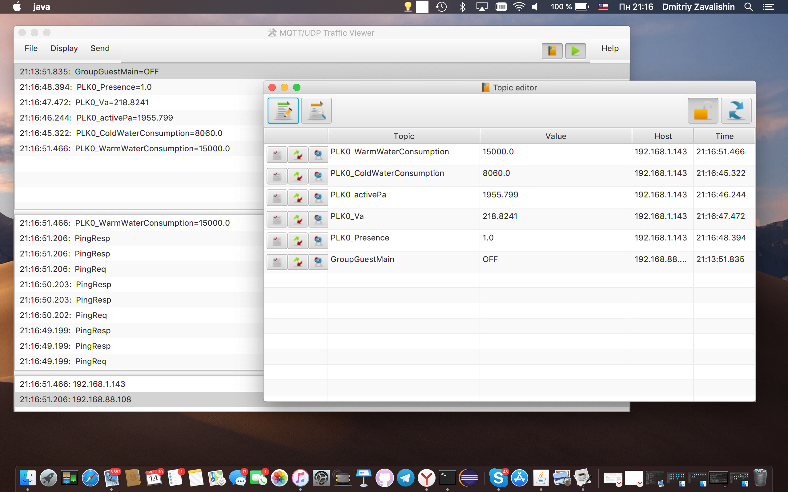
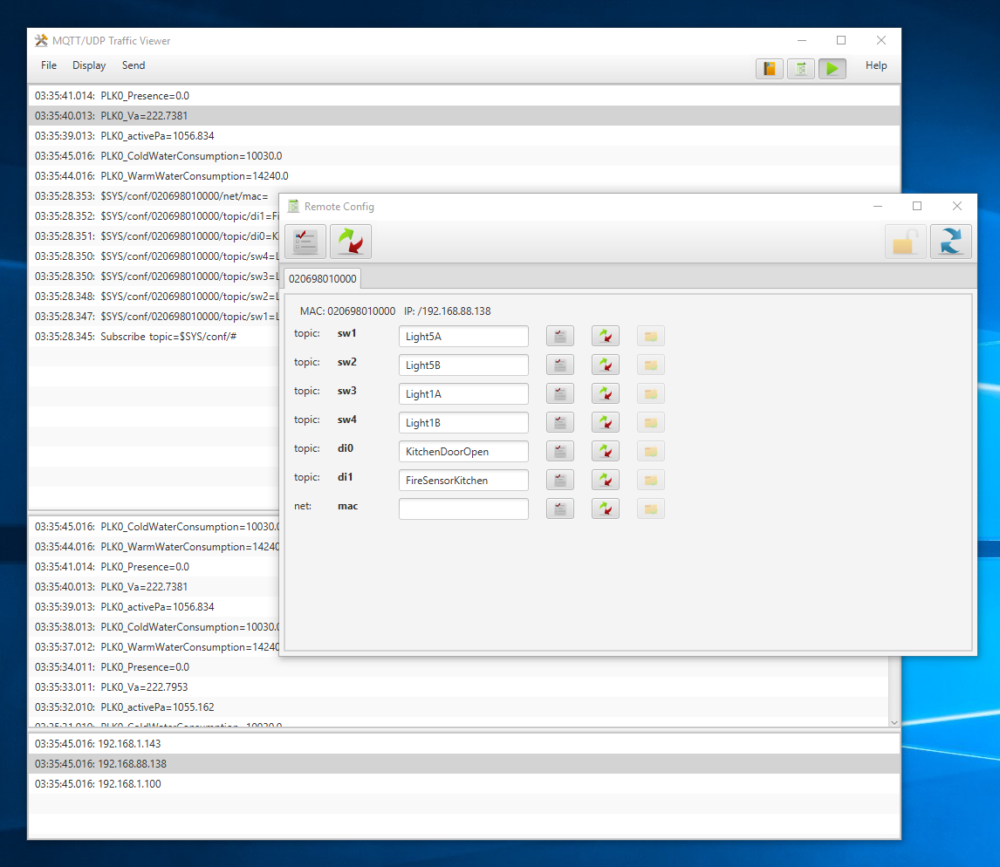
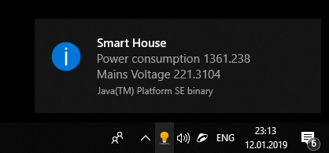
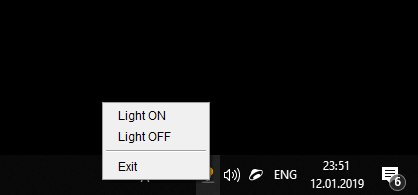
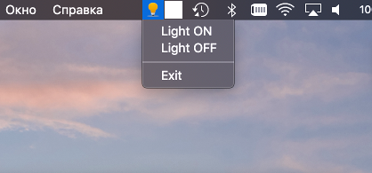

.. toctree::
   :maxdepth: 3
.. rem    :caption: Contents:


Welcome to MQTT/UDP
===================

.. only:: html

   Package version |version|
   
   You can get this document in `PDF format`_.

.. _PDF format: https://media.readthedocs.org/pdf/mqtt-udp/latest/mqtt-udp.pdf

.. rem Indices and tables
.. rem ------------------

.. rem .. only:: html

.. rem   * :ref:`genindex`
.. rem   * :ref:`modindex`
.. rem   * :ref:`search`


Introduction
------------


MQTT/UDP is a simplest possible protocol for IoT, smart home applications and 
robotics. As you can guess from its name, it is based on MQTT (which is quite 
simple too), but based on UDP and needs no broker.

.. sidebar:: *Network is a broker*

   Your network does most of the broker's work.

Fast track for impatient readers: MQTT/UDP native implementations exist in Java, 
Python, C, Lua and PLC specific ST language. See corresponding references:

* :ref:`c-lang-api`
* :ref:`java-lang-api`
* :ref:`python-lang-api`
* :ref:`lua-lang-api`
* :ref:`st-lang-api`

If you want to test MQTT/UDP on a real hardware, take a look at :ref:`sketches` 
part. Ready made software is described in :ref:`integration` part.

Now some words on MQTT/UDP idea. It is quite simple. Broker is a `single point 
of failure <https://en.wikipedia.org/wiki/Single_point_of_failure>`_ and can be avoided. Actual
traffic of smart home installation is not too big and comes over a separated (by firewall) 
network. There are many listeners that need same data, such as:

.. index:: single: OpenHAB

* main UI subsystem (such as OpenHAB installation)
* special function controllers (light, climate units)
* per-room or per-function controllers (kitchen ventilation, bath room sensors, room CO2 sensors, etc)
* in-room displays (room and outdoor temperature)

All these points generate some information (local sensors, state) and need 
some other information. By the way, CAN bus/protocol is made for quite the same requirements,
but is not good for TCP/IP and Ethernet. Actually, to some extent, MQTT/UDP is CAN for Ethernet.

So, MQTT/UDP is sending data with UDP broadcast. It means that every message 
is simuloneusly sent to all possible recipients with just one network packet.

Every listener selects packets it wants to listen to and processes them as it wishes.

As a result, minmal MQTT/UDP implementation is extremely simple. Though, there are more
options exist which are described later.

Main use cases for MQTT/UDP are covered below.


Data exchange
^^^^^^^^^^^^^

Main and, for most applicartions, the only use case. It is really simple. Sender transmits one
PUBLISH packet per message. Packet contains topic name (such as "rooms/dinner/temperature") and
value. Value can be text string or binary data, but most programs will wait for text as packet value.

As there is no broker, parties do not need such things as CONNNECT, SUBSCRIBE or anything else but
PUBLISH message.

All the MQTT/UDP programs on the network will receive message and decide if they need it.


Reliable exchange
^^^^^^^^^^^^^^^^^

Sender transmits PUBLISH message with non-zero QoS field. Receiver replies with
PUBACK packet. If no acknowledge received, sender re-sends message.

Current libraries do not support this scenario out of the box, but it can be implemented by user
code. Later versions of libraries will have this case implemented.


Data request
^^^^^^^^^^^^

There is request-reply scenario possible. Requesting party sends SUBSCRIBE message, one that is
responcible for requested topic replies with PUBLISH message.

This scenario can be used for remote configuration use case: configuration daemon keeps set of topics 
and configuration settings per topic, but does not send them to not to spam network with rarely
needed data. Some IoT device turns on and requests topics that contain needed configuration parameters,
gets needed settings and continues working.

If configuration settings are changed, config server re-publishes corresponding topics to update
device settings.

Please see Java ``config.Provider`` and ``config.Requester`` classes for further info.

There is also a ready simple remote configuration server in ``tools/config_server``.

Topic request
^^^^^^^^^^^^^

There is backwards scenario possible. Remote configuration program can send SUBSCRIBE message for
topic, that is a wildcard for all possible configuration topics for device or all devices.
Devices should respond back with PUBLISH messages for all the configurable items.

There is no ready made support for this scenario yet.

Discovery
^^^^^^^^^

Party that needs to find who is on the network sends PINGREQ request. All the others reply with
PINGRESP messages, and requester builds a map of all active MQTT/UDP hosts on the network.


Possible topologies
-------------------

Here is a list of more or less obvious scenarios for MQTT/UDP

Fault-tolerant sensors 
^^^^^^^^^^^^^^^^^^^^^^

Some 2-4 temperature sensors are placed in one room and send
updates every 10 seconds or so. Update topic is the same for all the
sensors, so that every reader gets mix of all the readings.

Reader should calculate average for last 4-8 readings.

Result: reader gets average temperature in room and failure of
one or two sensors is not a problem at all.

Trying to build corresponding configuration with traditional MQTT or,
for example, Modbus you will have to:

*   Setup broker
*   Setup transport (topic names) for all separate sensors
*   Setup some smart code which detects loss of updates from sensors
*   Still calculate average
*   Feed calculated average back if you want to share data with other system nodes

.. figure:: illustrations/AveragedSensors.*

   Typical MQTT/UDP use case.

   This diagram shows three sensors duplicating each other. For example,
   three outer temperature sensors. Wall display, history database and
   main smarthome unit get copy of all data from sensors. Malfunction of
   any unit does not make any problemn for others.

One sensor, many listeners
^^^^^^^^^^^^^^^^^^^^^^^^^^

IoT network is a lot of parties operating together. It is usual that
many of them need one data source to make a decision. Just as an example,
my house control system consists of about 10 processing units of different
size. Many of them need to know if it is dark outside, to understand how
to control local lighting. Currently I have to distribute light sensor data
via two possible points of failure - controller it is connected to and
OpenHub software as a broker. I'm going to swithch to MQTT/UDP and feed
all the units directly.


.. index:: single: UDP

Multiple smart switches
^^^^^^^^^^^^^^^^^^^^^^^

Some wall switches are controlling the same device. All of them send
and read one topic which translates on/off state for the device.

Of course, if one switch changes the state, all others read the state broadcast
and note it, so that next time each switch knows, which state it should
switch to.

It is possible, of course, that UDP packet from some switch will be lost.
So when you switch it, nothing happens. What do you do in such a situation?
Turn switch again, of course, until it works!

In this example I wanted to illustrate that even in this situation UDP
transport is not really that bad.


Roadside processor
^^^^^^^^^^^^^^^^^^

Data processors such as triggers, unit converters, calculators of
different kinds can be easily implemented with MQTT/UDP as standalone
script or a small program that just listens for required incoming data,
performs calculations and sends results back to MQTT/UDP.

Other script or IoT/SmartHome component can then use resulting data.

There is an example of such combination in MQTT/UDP repository. Java
program in ``tools/tray`` is setting up desktop tray informer which 
displays some MQTT/UDP parameters if user clicks on tray icon.

Companion script ``lang/python3/examples/trigger.py`` is listening to
some topic and if topic value is out of range sends information on
``tray/message`` topic with a worning. Tray program listens for that
topic and displays a warning to user on reception of such a message.

.. rem TODO draw an image


System debugging
^^^^^^^^^^^^^^^^

Broadcast/multicast nature of MQTT/UDP
lets you see what is going on on the "bus" exactly the same way as
all the parties see. There is a simple tool exist for that in this
repository, but you can use, for example well known WireShark as well.


.. index:: single: UDP

Reliability
-----------

.. NOTE::

   There's QoS support for MQTT/UDP is in development, which makes it as reliable as TCP version.

As MQTT/UDP is based on UDP protocol, which does not guarantee packet delivery, one can suppose that MQTT/UDP is not reliable. Is it?

Not at all.

If we use it for repeated updates, such as sensor data transfer, UDP is actually more reliable, than TCP! Really. If our network drops each
second packet, TCP connection will be effectively dead, attempting to resend again and again outdated packets which are not needed anymore.
And MQTT/UDP will just loose half of readings, which is not really a problem for 99% of installations. So, TCP helps just if packet loss rate
is quite low.

Actualy, I made simple test [#f1]_ to ckeck UDP reliability. One host in my house's local net was generating MQTT/UDP traffic as fast as 
possible and other checked packets to be sequent, counting speed and error rate. Two IPTV units was started to show HD content and one 
of the computers was copying some few GBytes to file server. Result was quite surprising: MQTT/UDP error rate grew to... 0.4% with about 50K
packets/second, but TV sets stopped showing, being, obviusly, starved.

Anyway, I'm going to add completely reliable mode to MQTT/UDP in near future.

.. rem TODO some graph of packet loss rate?

.. rubric:: Footnotes

.. [#f1] Corresponding tools are in repository and you can run such test yourself.


.. index:: single: throttle

Speed limit
^^^^^^^^^^^

There is one more reliability issue exist when we use UDP. Low power microcontrollers
are quite slow and their ability to receive lots of UDP packets per second are limited.
There is possible packet loss due to low processing power of some slow nodes, not because
of network delivery is not reliable.

That's why protocol implementations include throttling subsystem, which limits amount of
packets sent per time interval.

By default it is tuned for maximum of 10 packets per second. Java and Python implementations
use millisecond timing and send max of 3 packets with no speed limit, and then add 300 msec
pause. C implementation currently uses 1 second time granularity and lets application send
up to 10 packets with no limit and then waits for a second.

Actual tests of reception speed capability were done with Wemos D1 Mini unit programmed
with MQTT/UDP Lua implementation.

There is ``set_throttle``/``setThrottle`` function in all languages but Lua, which lets you set 
speed limit according to your hardware capabilities, or disable it at all by setting to 0.

Remote configuration
--------------------

MQTT/UDP can be used as a remote configuration protocol. There are two basic
modes of remote configuration: acive and passive. Active remote configuration mode
is needed when node to be configured has no local storage at all and has to
request all settings at each restart. Passive mode is good for nodes that keep
settings from start to start (in local FS or NVRAM) and configuration process is 
executed for them once or rarely.

.. _passive-rconfig:

Passive remote configuration
^^^^^^^^^^^^^^^^^^^^^^^^^^^^

Passive remote configuration is divided in three steps. First, when user
starts configurator GUI application, application sends (and repeats from time
to time) a SUBSCRIBE request. Second, any MQTT/UDP nodes that support remote
configuration see that request and answer with PUBLISH packet for all items
that can be set up. Last, configurator application sends back message with a new
item value.

.. figure:: diagrams/remote_configuration.*

   Passive remote configuration state diagram

   Basic remote configuration process. Configurator (which usually is a desktop
   application with GUI) sends SUBSCRIBE request, all nodes that support remote
   configuration answer with a list of items that can be configured. User sets 
   new value for an item and configurator updates it with PUBLISH message.

All the configurable items must have special topic name: ``$SYS/conf/{node-id}/{kind}/{name}``.
For example: ``$SYS/conf/024F55A20001/info/uptime``.

Node id
~~~~~~~

Node id is any string that will not change at least during one program run or
node start. If just one MQTT/UDP program is run on this hardware, you can use
net MAC address as id. Otherwise some GUID will do. Note that node-id can be
configurable item too!

.. index:: single: kind

Item kind
~~~~~~~~~

There are four predefined kinds:

``info``
   This kind is a readonly description which can not be configured
   but tells other side about us. There are ``info/soft`` - name
   of program, ``info/ver`` - version of program, ``info/uptime`` - 
   as is.

``node``
   This kind describes setting for program/device in general and is editable
   by user. Name and location are obvious items to be in this kind.
   Any other global (not related to specific function or input/output)
   setting can be added to this kind.

``topic``
   This kind is treated as configurable value that is a topic name
   used to send or receive data. Item name must be descriptive so
   that user can understand what it is about.

``net``
   Reserved for network settings.

You can use other kind strings as you wish. They will not be interpreted in
any way.


Item name
~~~~~~~~~

Just a descriptive name of an item, quite short but understandable by human.
In a later version there will be added long human readable description, but
in any case item name must be reasonable.

Predefined items
~~~~~~~~~~~~~~~~

Protocol implementations expect some item kind/name pairs to mean special thins.
Here is a list of know ones.

``info/soft``
   Readonly, name of software running in this node.

``info/ver``
   Readonly, version of software.

``info/uptime``
   Text string, uptime: "255d 02:12:34" or "5y 2m 13d 23:55:01"

``node/name``
   Name of this MQTT/UDP node. Human readable, not interpreted. "Weather sensors"
   or "A/C control"

``node/location``
   Where you can find it: "Kitchen", "building 12, 2nd floor, room 212", whatever.

``net/mac``
   Network MAC address, if not hardwired.

``net/ip``
   Network IP address, if static.

``net/mask``
   Netmask.

``net/router``
   Network default route.

Other network settings can be put to ``net`` kind.

Implementations
~~~~~~~~~~~~~~~

Configurator GUI tool exists as part of big Java MQTT/UDP viewer program,
see ``tools/viewer`` and ``build/mqtt_udp_view.*``. Clien implementations
examples are done for most project languages.

**Java**
    ``RemoteConfig`` class in ``ru.dz.mqtt_udp.config`` package.
    Simple example code is in ``main`` function of this class.

**Python**
    Example code is in ``lang/python3/examples/mqtt_udp_rconfig.py``.

**C**
    Simple example code is in ``lang/c/examples/rconfig.c``.
    More advanced embedded atmega microcontroller example 
    application is in a separate repository, see 
    https://github.com/dzavalishin/smart-home-devices/tree/master/mmnet_mqt_udp_server/main

**Lua**
    Lua example is up and running, but as Lua has no threads,
    adding this example to a real program will require quite
    a clever tailoring. See ``lang/lua/examples/mqtt_rconfig.lua``

Active remote configuration
^^^^^^^^^^^^^^^^^^^^^^^^^^^

Active remote configuration is even simpler than passive one.
Staring node just requests in a loop all the items it needs 
to run. Configuration server replies with settings. Node
continues working when all critical data is received. Server
can proactively update settings later if some of them are
changed.

.. figure:: diagrams/remote_configuration_active.*

   Active remote configuration state diagram

Implementations
~~~~~~~~~~~~~~~

Currently this mode is implemented in Java as classes ``Requester`` and ``Provider``
(``ru.dz.mqtt_udp.config`` package) and server application ``tools/config_server``.
See also ``build/config_server.sh``.


Packets and general logic
=========================

Differences from MQTT
---------------------

MQTT/UDP is based on classic MQTT, but differs a bit. Frist of all, just a subset of
packet types used and, of course, as there is no broker there is no need for CONNECT,
CONNACK or DISCONNECT.

Additionally, MQTT/UDP does not send or expect variable header (packet ID field)
present in some MQTT packets.

Current implementation also ignores packet flags completely, but it will change later.

Currently in the development an Tagged Tail Records addition to the protocol, which
extends and replaces variable header in an extencible and flexible way.

Please read `description at project Wiki <https://github.com/dzavalishin/mqtt_udp/wiki/Tagged-Tail>`_.


Packet types and use
--------------------

**PUBLISH**
   It is extremely simple to use MQTT/UDP. Basic use case is: one party sends **PUBLISH** packets,
   other receives, selecting for itself ones with topics it needs. That is all. No connect,
   no subscribe, no broker address to configure - we're broadcasting.

   For most applications it is all that you need. But there are 3 other packet types that possibly can 
   be used.

**SUBSCRIBE**
   MQTT/UDP uses this as a request to resend some topic value. It is not automated in any way by library code (but will be),
   so you have to respond to such a packet manually, if you want. It is intended for remote configuration use to let configuration
   program to request settings values from nodes. This is to be implemented later.

**PINGREQ**
   Ping request, ask all nodes to reply. This is for remote configuration also, it helps config program to detect all nodes on the network.
   Library code automatically replies to ``PINGREQ`` with ``PINGRESP``.

**PINGRESP**
   Reply to ping. You don't need to send it manually. It is done automatically.

It is supposed to use **PUBACK** packet later to support reliable delivery.


Topic names
-----------

One important thing about topics is **$SYS** topic. MQTT/UDP is a broadcast environment, so each node which wants to use **$SYS**
must distinguish itself by adding IP address or host name as first subtopic under **$SYS**: **$SYS/192.168.1.33**. Topic name 
**$SYS/hostname/config** is to be used for configurable from network parameters.

.. rem TODO list of parameters

One more special thing I'm going to use is **$META** topic name suffix. It will possibly be used to request/send topic metadata.
For example, if we have **kitchen/temperature** topic, then **kitchen/temperature/$META/name** can be used to pass printable
topic name, and **kitchen/temperature/$META/unit** - to send measuring unit name.


API Reference
=============

MQTT/UDP is implemented in five languages, but implementations differ. Most 
complete and fast developing are Java and Python versions. Others
follow a bit later. Please see `map of languages and features <https://github.com/dzavalishin/mqtt_udp/wiki/Features-and-languages-map>`_ on a project Wiki.

.. _c-lang-api:

C Language API Reference
------------------------


There is a native MQTT/UDP implementation in C. You can browse sources at https://github.com/dzavalishin/mqtt_udp/tree/master/lang/c repository.


Lets begin with a simplest examples.

.. index:: single: send

Send data::


    int rc = mqtt_udp_send_publish( topic, value );


.. index:: single: listen

Listen for data::


    int main(int argc, char *argv[])
    {
        ...
    
        int rc = mqtt_udp_recv_loop( mqtt_udp_dump_any_pkt );
    
        ...
    }
    
    int mqtt_udp_dump_any_pkt( struct mqtt_udp_pkt *o )
    {
    
        printf( "pkt %x flags %x, id %d",
                o->ptype, o->pflags, o->pkt_id
              );
    
        if( o->topic_len > 0 )
            printf(" topic '%s'", o->topic );
    
        if( o->value_len > 0 )
            printf(" = '%s'", o->value );
    
        printf( "\n");
    }


Now lets look at the packet structure definition::

    struct mqtt_udp_pkt
    {
        int         from_ip;
    
        int         ptype;          // upper 4 bits, not shifted
        int         pflags;         // lower 4 bits
    
        size_t      total;          // length of the rest of pkt down from here
    
        int         pkt_id;
    
        size_t      topic_len;
        char *      topic;
    
        size_t      value_len;
        char *      value;
    };


**from_ip**
   Ip address of message sender. Usually ignored.
   
**ptype**
   Packet type. You will be interested in ```PTYPE_PUBLISH``` most of time. 
   See ```mqtt_udp_defs.h``` for more.

**pflags**
   Flags specific for each type. Ignore. Current version of MQTT/UDP 
   does not use them at all, ad later everything critical will be
   processed by library.
   
**total**
   This field is internal for library.

**pkt_id**
   Later version will support it, currently not used at all.
   
**topic** and **topic_len**
   Message topic, NULL terminated. Length of topic in bytes.
   
**value** and **value_len**
   Message value, also NULL terminated. Length of value in bytes.
   

.. index:: single: listen

Listen for packets
^^^^^^^^^^^^^^^^^^

See `Example C code <https://github.com/dzavalishin/mqtt_udp/blob/master/lang/c/mqtt_udp_listen.c>`_.

For listening for data from the network you need just some of fields. First, you have to check
that packet is transferring item data::

    struct mqtt_udp_pkt p;
    
    if( p->ptype == PTYPE_PUBLISH )
    {
    // Got data message
    }

For the first implementation just ignore all other packets. Frankly, there's not much for you to ignore.

Now get topic and data from packet you got::


    strlcpy( my_value_buf, p->value, sizeof(my_data_buf) );
    strlcpy( my_topic_buf, p->topic, sizeof(my_topic_buf) );


And you're done, now ypou have topic and value received.


Includes
^^^^^^^^

There's just one::

    #include "mqtt_udp.h"


.. index:: single: send

Functions
^^^^^^^^^

Send PUBLISH packet::

    int mqtt_udp_send_publish( char *topic, char *data );

Send SUBSCRIBE packet::

    int mqtt_udp_send_subscribe( char *topic );

Send PINGREQ packet, ask others to respond::

    int mqtt_udp_send_ping_request( void );

Send PINGRESP packet, tell that you're alive::

    int mqtt_udp_send_ping_responce( void );


Start loop for packet reception, providing callback to be called 
when packet arrives::

    typedef int (*process_pkt)( struct mqtt_udp_pkt *pkt );

    int mqtt_udp_recv_loop( process_pkt callback );

Dump packet structure. Handy to debug things::

    int mqtt_udp_dump_any_pkt( struct mqtt_udp_pkt *o );


.. index:: single: throttle

Set time between packets (msec), control maximum send speed::

    void mqtt_udp_set_throttle(int msec);

.. index:: single: error handler

Set callback to handle internal errors such as net IO error::

   typedef enum {
       MQ_Err_Other,
       MQ_Err_Establish,   // open socket
       MQ_Err_IO,          // net io
       MQ_Err_Proto,       // broken pkt
       MQ_Err_Timeout,
   } mqtt_udp_err_t;
   
   typedef int err_func_t( mqtt_udp_err_t type, int err_no , char * msg, char * arg );
   
   void mqtt_udp_set_error_handler( err_func_t *handler );

User error handler can:

* Return zero: caller must attempt to ignore error, if possible.
* Return err_no: caller must return with error in turn, if possible.
* Exit (or restart application completely) if error is supposed to be fatal.

Handler can also be used for logging.


.. index:: single: UDP

UDP IO interface
^^^^^^^^^^^^^^^^

Default implementation uses POSIX API to communicate with network, but for 
embedded use you can redefine corresponding functions. Here are things to 
reimplement.

Receive UDP packet. Returning value is number of bytes in packet received or
negative error code. Must return sender's address in ``src_ip_addr``::

    int mqtt_udp_recv_pkt( int fd, char *buf, size_t buflen, int *src_ip_addr );

Broadcast UDP packet::

    int mqtt_udp_send_pkt( int fd, char *data, size_t len );

Send UDP packet (actually not used now, but can be later)::

    int mqtt_udp_send_pkt_addr( int fd, char *data, size_t len, int ip_addr );

Create UDP socket which can be used to send or broadcast::

    int mqtt_udp_socket(void);

Prepare socket for reception on MQTT_PORT::

    int mqtt_udp_bind( int fd )

Close UDP socket::

    int mqtt_udp_close_fd( int fd ) 


.. index:: single: match

Service
^^^^^^^

Match topic name against a pattern, processing `+` and `#` wildcards, returns 1 on match::

   int ok = mqtt_udp_match( wildcard, topic_name )


Remote configuration
^^^^^^^^^^^^^^^^^^^^

This part of API lets user to configure program/device by network. There is a detailed
description in Python part of this book, see :ref:`python-rconfig-api`. Here is description
of C implementation.

Set up remote config subsystem::

   #include "runtime_cfg.h"

   mqtt_udp_rconfig_item_t rconfig_list[] =
   {
       { MQ_CFG_TYPE_STRING, MQ_CFG_KIND_TOPIC, "Switch 1 topic",	"topic/sw1", { .s = 0 } },
       { MQ_CFG_TYPE_STRING, MQ_CFG_KIND_TOPIC, "Switch 2 topic",	"topic/sw2", { .s = 0 } },
       { MQ_CFG_TYPE_STRING, MQ_CFG_KIND_TOPIC, "Di 0 topic",           "topic/di0", { .s = 0 } },
       { MQ_CFG_TYPE_STRING, MQ_CFG_KIND_TOPIC, "Di 1 topic",           "topic/di1", { .s = 0 } },
   
       { MQ_CFG_TYPE_STRING, MQ_CFG_KIND_OTHER, "MAC address",          "net/mac",   { .s = 0 } },
   
       { MQ_CFG_TYPE_STRING, MQ_CFG_KIND_INFO, "Switch 4 topic",        "info/soft",   { .s = DEVICE_NAME } },
       { MQ_CFG_TYPE_STRING, MQ_CFG_KIND_INFO, "Switch 4 topic",        "info/ver",    { .s = 0 } },
       { MQ_CFG_TYPE_STRING, MQ_CFG_KIND_INFO, "Switch 4 topic",        "info/uptime", { .s = 0 } },
   
       { MQ_CFG_TYPE_STRING, MQ_CFG_KIND_OTHER, "Name", 		"node/name",     { .s = 0 } },
       { MQ_CFG_TYPE_STRING, MQ_CFG_KIND_OTHER, "Location", 	        "node/location", { .s = 0 } },
   };   
   
   int rconfig_list_size = sizeof(rconfig_list) / sizeof(mqtt_udp_rconfig_item_t);

   int rc = mqtt_udp_rconfig_client_init( mac_string, rconfig_rw_callback, rconfig_list, rconfig_list_size );
   if( rc ) printf("rconfig init failed, %d\n", rc );
   
Each array item is one parameter to be set up remotely. The only type supported now is ``MQ_CFG_TYPE_STRING``. Kinds:

MQ_CFG_KIND_INFO
   Read-only information about this instance (program or device)
   
MQ_CFG_KIND_TOPIC
   Is a configurable topic name, used to publish or receive information.

MQ_CFG_KIND_OTHER
   Any other parameter type. (R/W and not topic)

Third item field is human-readable item description, currently it is not used, but will be translated to
configuration tool. Fourth item is identification of configurable item, both for local and remote side.
For remote side it is sent as part of configuration message topic and is shown to user as configuration
iem description. Last field is current parameter value. For read-only parameters you can just put any string
pointer here. For R/W string must be malloc'ed (or set with ``mqtt_udp_rconfig_set_string()``).

To be precise::

   /// Definition of configuration parameter
   typedef struct
   {
       mqtt_udp_rconfig_item_type_t        type;   ///< Item (.value field) data type (string, bool, number, other)
       mqtt_udp_rconfig_inetm_kind_t       kind;   ///< Item kind, not processed by network code
       const char *                        name;   ///< Human readable name for this config parameter
       const char *                        topic;  ///< MQTT/UDP topic name for this config parameter
       mqtt_udp_rconfig_item_value_t       value;  ///< Current value
       mqtt_udp_rconfig_item_value_t       opaque; ///< user data item, not processed by MQTT/UDP code at all
   } mqtt_udp_rconfig_item_t;

type
   Data type for ``.value``, must be MQ_CFG_TYPE_STRING as for now.
   
kind
   Kind of item, see above. If kind is MQ_CFG_KIND_TOPIC, ``.topic`` field must begin with "topic/".
   
name
   Human-readable description, unused now.
   
value
   Current value. You will be using ``.value.s`` union field.

opaque
   Not used or interpreted, use as pointer to external storage for this item, 
   internal item index or function pointer to read/set item as you wish.


Now lets look at available functions.

Init subsystem::

   int rc = mqtt_udp_rconfig_client_init( mac_string, rconfig_rw_callback, rconfig_list, rconfig_list_size );

mac_string
   Id string (12 bytes) used as unique id of this configurable instance. MAC address of device is
   a good candidate.

rconfig_rw_callback
   Callback called by subsystem to ask you provide current value for item or get new setting
   after instance item was remotely set up. Prototype is ``int rconfig_rw_callback( int pos, int write )``,
   where ``pos`` is item position (index) in array and ``write`` is nonzero if callback shall
   get new setting from instance array and save it somewhare for next run. If zero, callback
   must read saved instance value and call ``mqtt_udp_rconfig_set_string()`` for it.


Set item value::

   int mqtt_udp_rconfig_set_string( int pos, char *string );

pos
   Item position (index) in array
   
string
   New value

Get item value checking kind::

   const char * rconfig_get_string_by_item_index( int pos, mqtt_udp_rconfig_inetm_kind_t kind );

pos
   Item position (index) in array

kind
   Expected kind for item. If not, global error callback is called and ``NULL`` is returned.
   This function is supposed to be used to get configurable topic for outgoing message
   so usually this parameter is ``MQ_CFG_KIND_TOPIC``.


Find item by ``.value`` string::

   int rconfig_find_by_string_value( const char *search, mqtt_udp_rconfig_inetm_kind_t kind );
   
search
   String value to be found.

kind
   Only lines of this kind will match. This function is supposed to look up
   incoming items topics to find if some of configurable topics match. So
   this parameter usually is ``MQ_CFG_KIND_TOPIC``.


Please study this API use example in `sample remote config C application`_.

.. _sample remote config C application: https://github.com/dzavalishin/smart-home-devices/blob/master/mmnet_mqt_udp_server/main/rconfig_client.c


.. _java-lang-api:

Java Language API Reference
---------------------------


There is a native MQTT/UDP implementation in Java. You can browse sources at https://github.com/dzavalishin/mqtt_udp/tree/master/lang/java repository.


Again, here are simplest examples.

.. index:: single: send

Send data::


    PublishPacket pkt = new PublishPacket(topic, value);
    pkt.send();


.. index:: single: listen

Listen for data::


    PacketSourceServer ss = new PacketSourceServer();
    ss.setSink( pkt -> { 
        System.out.println("Got packet: "+pkt);
    
        if (p instanceof PublishPacket) {
            PublishPacket pp = (PublishPacket) p;			
        }
    
    });


Listen for packets
^^^^^^^^^^^^^^^^^^

See `Example Java code <https://github.com/dzavalishin/mqtt_udp/blob/master/lang/java/src/ru/dz/mqtt_udp/util/Sub.java>`_.


Here it is::

    package ru.dz.mqtt_udp.util;
    
    import java.io.IOException;
    import java.net.SocketException;
    
    import ru.dz.mqtt_udp.IPacket;
    import ru.dz.mqtt_udp.MqttProtocolException;
    import ru.dz.mqtt_udp.SubServer;
    
    public class Sub extends SubServer 
    {
    
        public static void main(String[] args) throws SocketException, IOException, MqttProtocolException 
        {
            Sub srv = new Sub();
            srv.start();
        }

        @Override
        protected void processPacket(IPacket p) {
            System.out.println(p);
                
            if (p instanceof PublishPacket) {
                PublishPacket pp = (PublishPacket) p;

                // now use pp.getTopic() and pp.getValueString() or pp.getValueRaw()
            }
        }
    }


Now what we are doung here. Our class ``Sub`` is based on ``SubServer``, which is doing all the reception job, and calls ``processPacket``
when it got some data for you. There are many possible types of packets, but for now we need just one, which is
``PublishPacket``. Hence we check for type, and convert::

    if (p instanceof PublishPacket) {
        PublishPacket pp = (PublishPacket) p;

Now we can do what we wish with data we got using ``pp.getTopic()`` and ``pp.getValueString()``.


Listen code we've seen in a first example is slightly different::


    PacketSourceServer ss = new PacketSourceServer();
    ss.setSink( pkt -> { 
        System.out.println("Got packet: "+pkt);
    
        if (p instanceof PublishPacket) {
            PublishPacket pp = (PublishPacket) p;			
        }
    
    });

Used here ``PacketSourceServer``, first of all, starts automatically, and uses ``Sink`` you pass to ``setSink``
to pass packets received to you. The rest of the story is the same.


There is another, more complex listen server class, ```PacketSourceMultiServer```. 
Instance of it can provide incoming packets to more than one listener::

	PacketSourceMultiServer ms = new PacketSourceMultiServer();
        ms.addPacketSink( first_listener );
        ms.addPacketSink( next_listener );
        ms.start(); // Does not start automatically


.. index:: single: send

Packet classes
^^^^^^^^^^^^^^

There are ``PublishPacket``, ``SubscribePacket``, ``PingReqPacket`` and ``PingRespPacket``. Usage is extremely simple::

   new PingReqPacket().send();


.. index:: single: match

Service
^^^^^^^

Match topic name against a pattern, processing `+` and `#` wildcards, returns true on match::

   TopicFilter tf = new TopicFilter("aaa/+/bbb");
   boolean matches = tf.test("aaa/ccc/bbb") );

TopicFlter is a Predicate (functional interface implementation).

.. rem TODO example of incoming packets filtering


Control
^^^^^^^

**setMuted( boolean mute )**
   PacketSourceServer and PacketSourceMultiServer can be swiched to not to 
   reply to any incoming packet (such as PING) automatically.

.. index:: single: throttle

**Engine.setThrottle(int msec)**
   Set average time in milliseconds between packets sent. Set to 0 to turn throttling off.


Digital Signature
^^^^^^^^^^^^^^^^^

.. NOTE::

   Development is in progress, not a final implementation.

Java ``ru.dz.mqtt_udp.Engine`` class has preliminary controls for message digital
signature. It is implemented with HMAC MD5 technology.

Set signature secret key to sign and check signature::

   void setSignatureKey(String key)

Set requirement for all incoming packets to be signed::

   void setSignatureRequired(boolean req)

At this moment other language implementations ignore and do not generate signature at all.


.. _python-lang-api:

Python Language API Reference
-----------------------------

As you already guessed, python implementation is native too. You can browse 
sources at https://github.com/dzavalishin/mqtt_udp/tree/master/lang/python3 
repository.
There is also lang/python directory, which is for older 2.x python environment, 
but it is outdated. Sorry, can't afford to support it. If you need python 2.x, 
you can backport some python3 code, it should be quite easy.


Let's begin with examples, as usual.

.. index:: single: send

Send data::


    mqttudp.engine.send_publish( "test_topic", "Hello, world!" )


.. index:: single: listen

Listen for data::


    def recv_packet(ptype,topic,value,pflags,addr):
        if ptype != "publish":
            print( ptype + ", " + topic + "\t\t" + str(addr) )
            return
        print( topic+"="+value+ "\t\t" + str(addr) )
       
    mqttudp.engine.listen(recv_packet)


Module mqttudp.engine
^^^^^^^^^^^^^^^^^^^^^

Main package, implements MQTT/UDP protocol.

* ``send_ping()`` - send PINGREQ packet.
* ``send_ping_responce()`` - send PINGRESP packet. It is sent automatically, you don't have to.
* ``listen(callback)`` - listen for incoming packets.
* ``send_publish( topic, payload)`` - this what is mostly used.
* ``send_subscribe(topic)`` - ask other party to send corresponding item again. This is optional.
* ``set_muted(mode: bool)`` - turn off protocol replies. Use for send-only daemons which do not need to be discovered.


.. index:: single: match

Match topic name against a pattern, processing `+` and `#` wildcards, returns True on match::

   import mqttudp.engine as me
   me.match("aaa/+/bbb", "aaa/ccc/bbb")

Turn of automatic protocol replies::

   set_muted(mode: bool)

.. index:: single: throttle

Set minimum time between packets sent, msec::

   set_throttle(msec: int)


.. index:: single: OpenHAB

.. _python-ini-file:

Module mqttudp.config
^^^^^^^^^^^^^^^^^^^^^

Additional module, sets up configuration file reader. Most command line utilities use it to get settings.
It reads ``mqtt-udp.ini`` file in current directory. Here is an example::


    [DEFAULT]
    host = smart.
    
    [mqtt-gate]          # Settings for MQTT to MQTT/UDP gate
    login = 
    password = 
    
    subscribe=#
    #host = smart.       # See [DEFAULT] above
    
    #blacklist=/topic    # Regexp to check if topic is forbidden to relay
    #blacklist=/openhab
    
    [openhab-gate]
    #port=8080           # There's builtin default
    #host = smart.       # Settings for MQTT/UDP to OpehHAB gate
    
    #blacklist=/topic    # Regexp to check if topic is forbidden to relay

    # which sitemap to use for reading data from openhab
    #sitemap=default

Usage::

    import mqttudp.config as cfg
    
    cfg.setGroup('mqtt-gate')           # set ours .ini file [section]
    
    blackList=cfg.get('blacklist')      # read setting


.. index:: single: Remote config
.. _python-rconfig-api:

Module mqttudp.rconfig
^^^^^^^^^^^^^^^^^^^^^^

Additional module implemening passive remote configuration client
(party that is being configured) implementation.

There is a complete demonstration example exist.

To see example working please run ``mqtt_udp_rconfig.py`` first
and mqtt_udp_view after it. In viewer please press middle toolbar button
to open remote configuration window. This window will show all 
running MQTT/UDP instances that can be configured. There must be 
``Python test node`` among them. Select its tab. You will see all
the configurable items (from ``init_items`` dictionary) as text
fields. Meanwhile ``mqtt_udp_rconfig.py`` will be sending a random
number with "test" topic. Enter new topic name in a field near 
"topic: test" description and press nearest button to send new 
setting to program. Notice that now it sends random data with a topic
you just set up.

Now lets look at example code (see examples/mqtt_udp_rconfig.py)::

    import mqttudp.rconfig as rcfg

    init_items = {
        ## read only
        "info/soft"         : "Pyton example",
        "info/ver"          : "0.0",
        "info/uptime"       : "?",

    	## common instance info
        "node/name"         : "Unnamed",
        "node/location"	    : "Nowhere",

    	# items we want to send out
        "topic/test"  	    : "test",
        "topic/ai0"         : "unnamed_ai0",
        "topic/di0"         : "unnamed_di0",

        "topic/pwm0"        : "unnamed_pwm0",    
    }

    def send_thread():
        while True:
            n = str(random.randint(0, 9))
            print( "Send "+n )
            rcfg.publish_for( "test", n )
            time.sleep(2)
    

    if __name__ == "__main__":
        print( "Will demonstrate remote config" )
        rcfg.init( init_items )

        st = threading.Thread(target=send_thread, args=())
        st.start()

        mq.listen( rcfg.recv_packet )

This example shows how to use remote configuration subsystem. Dictionary
``init_items`` contains list of items which can possiblly be configured
remotely. Different elements are used in a different ways.

In general each item in a list is a configurable thing. For example,
``"node/location" : "Nowhere"`` is item which name is ``node/location``
and initial value is ``Nowhere``. (It is supposed as a memo for user
to know where an appliance or computer running this code is installed.)
Another example is ``"topic/ai0" : "unnamed_ai0"`` - it is supposed
to be a configurable topic name that device uses to send data from 
some analogue input. User must configure topic name and it will be
used by node to send data.

Generally item keys consist of two parts
separated with slash: ``"topic/pwm0"``, ``"info/uptime"`` or 
``"node/name"``. Left part is named **kind** and defines the way item 
is processed. Here is a list of known kinds.

``info``
   Read only description of node/program.

``node``
   General node information or settings. 

``topic``
   This kind is a configurable value that is a topic name.

``net``
   Reserved for network settings.

Please see more on kinds in :ref:`passive-rconfig`.

Lets go on with code. Line ``rcfg.init( init_items )`` sets subsystem
up. Remote config subsystem first loads previous settings from .ini file
(you can set file name with ``set_ini_file_name(fn)`` function) and
fills all items from given ``init_items`` dictionary that was not read
from .ini file. Items with ``info`` kind are taken from ``init_items``
in any way.

After init your program continues working, but must call ``recv_packet``
function of ``mqttudp.rconfig`` for each incoming MQTT/UDP packet for
remote configuration to work.

There are three ways to use configured parameters.

Just read parameter
   You can just call ``get_setting( name )`` for needed item to get current
   configured value. For example, ``get_setting( "net/mac" )`` or, say,
   ``lcd_print( get_setting( "node/location" ))``. If your node will be
   reconfigured in run time, on next call there will be new value.

Send data for configurable topic
   By calling ``publish_for( item_of_topic, data )`` you will send data
   to a topic which is configured by item with, guess what, ``topic`` kind.
   See above ``rcfg.publish_for( "test", n )`` - this line looks up config
   item named ``topic/test``, and uses its value as a topic to publisn 
   value of varible ``n`` to. 

Check incoming packet topic
    On receiving incoming PUBLISH packet, you can use ``is_for( topic_item, topic )``
    function, which checks ``topic`` parameter to be equal to value of config
    item named ``"topic/"+topic_item``, such as ``is_for( "pwm0", topic )`` will
    return ``True`` if ``topic`` variable contains string equal to value of config
    item ``"topic/pwm0"``.

Only thing left to mention is that you can set callback with call to ``set_on_config( callback )``
and it will be called if remote configuration happens. Config item name and
new value will be passed as parameters.


Module mqttudp.interlock
^^^^^^^^^^^^^^^^^^^^^^^^

Additional module, implements two classes: ``Bidirectional`` and ``Timer``.

``Bidirectional`` is used by bidiractional gateways to prevent loop traffic::

    # Init interlock object which will
    # forbid reverse direction traffic
    # for 5 seconds after message passed
    # in one direction.
    
    ilock = mqttudp.interlock.Bidirectional(5) 

    # Check if we can pass forward

    if ilock.broker_to_udp(msg.topic, msg.payload):
        mqttudp.engine.send_publish( msg.topic, msg.payload )
        print("To UDP: "+msg.topic+"="+str(msg.payload))
    else:
        print("BLOCKED to UDP: "+msg.topic+"="+str(msg.payload))

    # and back

    if ilock.udp_to_broker(topic, value):
        bclient.publish(topic, value, qos=0)
        print( "From UDP: "+topic+"="+value )
    else:
        print( "BLOCKED from UDP: "+topic+"="+value )

Value is not actually used in current implementation. It is passed
for later and smarter versions.

``Timer`` prevents updates from coming too frequently::

    it = mqttudp.interlock.Timer(10)

    if it.can_pass( topic, value ):
        print("From broker "+topic+" "+value)
        mqttudp.engine.send_publish( topic, value )
    else:
        print("From broker REPEAT BLOCKED "+topic+" "+value)


It checks if value is changed. Such values are permitted to pass through.
Unchanged ones will pass only if time (10 seconds in this example) is passed
since previous item come through.


.. module:: mqttudp.mqtt_udp_defs

Module mqttudp.mqtt_udp_defs
^^^^^^^^^^^^^^^^^^^^^^^^^^^^


This module is not for user code, it is used internally. But you can get library release version from it::

    PACKAGE_VERSION_MAJOR = 0
    PACKAGE_VERSION_MINOR = 4


.. _lua-lang-api:

Lua Language API Reference
--------------------------

.. rem NOTE::

.. rem   Lua API is not final.

You can browse sources at https://github.com/dzavalishin/mqtt_udp/tree/master/lang/lua repository.


Basic examples in Lua.

.. index:: single: send

Send data::


    local mq = require "mqttudp"
    mq.send_publish( topic, val );


.. index:: single: listen

Listen for data::


    local mq = require "mqttudp"
    
    local listener = function( ptype, topic, value, ip, port )
        print("'"..topic.."' = '"..val.."'".."	from: ", ip, port)
    end
    
    mq.listen( listener )


.. index:: single: send

Send packets
^^^^^^^^^^^^

There are functions to send different kinds of packets::

   local mq = require "mqttudp"

   mq.send_pingreq()
   mq.send_pingresp()
   mq.send_subscribe( topic )
   mq.send_publish( topic, value )


.. index:: single: match

Service
^^^^^^^

Match topic name against a pattern, processing `+` and `#` wildcards, returns ``true`` on match::

   local mu = require "mqttudp"
   local ok = mu.match( wildcard, topic_name )


NodeMCU
^^^^^^^

There is a version of Lua library for NodeMCU microcontroller firmware.
See ``lang/lua/nodemcu`` for examples.


.. _st-lang-api:

CodeSys ST Language API Reference
---------------------------------

.. NOTE::

   This implementation ise currently send only.

Sorry, due to PLC limitations, there is no clear API in this code example, just integrated protocol
and client code example. 

PLC is specific: it runs all its programs in loop and it is assumed that each program is running
without blocking and does not spend too much time each loop cycle. There's usually a watch dog
that checks for it. Hence, ST implementation is cycling, sending just one topic per loop cycle.

.. index:: single: send

Actual API is simple:

.. code-block:: pascal

    FUNCTION MQTT_SEND : BOOL
    
    VAR_INPUT
        socket          : DINT;

        topic           : STRING;
        data            : STRING;

        sock_adr_out    : SOCKADDRESS;
    END_VAR
    

    FUNCTION MQ_SEND_REAL : BOOL
    VAR_INPUT
        socket          : DINT;
        m_SAddress      : SOCKADDRESS;

        topic           : STRING;
        data            : REAL;
    END_VAR


Here is how it is used in main program:

.. code-block:: pascal

    PROGRAM MQTT_PRG
    VAR
        STEP         : INT  := 0;
        socket       : DINT := SOCKET_INVALID;
        wOutPort     : INT  := 1883;
        addr         : SOCKADDRESS;
    
    END_VAR
    
    CASE STEP OF
        0:
            socket := SysSockCreate( SOCKET_AF_INET, SOCKET_DGRAM, SOCKET_IPPROTO_UDP );

            addr.sin_family := SOCKET_AF_INET;
            addr.sin_port   := SysSockHtons( wOutPort );
            addr.sin_addr   := 16#FFFFFFFF; (* broadcast *)

        1:  MQ_SEND_REAL( socket, addr,  'PLK0_WarmWater', WarmWaterConsumption );
        2:  MQ_SEND_REAL( socket, addr,  'PLK0_ColdWater', ColdWaterConsumption );

        3:  MQ_SEND_REAL( socket, addr,  'PLK0_activePa', activePa_avg );
        4:  MQ_SEND_REAL( socket, addr,  'PLK0_Va', Va );
    
    ELSE
        IF socket <> SOCKET_INVALID THEN
            SysSockClose( socket );
        END_IF
        socket := SOCKET_INVALID;
    END_CASE

    STEP := STEP + 1;
    
    IF socket = SOCKET_INVALID THEN
        STEP := 0;
    END_IF
    
    END_PROGRAM


.. _integration:

Integration and tools
=====================


Connectors
----------

Project includes two simple connectors. One joins MQTT/UDP with classical MQTT, other connects to OpenHAB.

All the tools read ``mqtt-udp.ini`` file, see :ref:`python-ini-file` for detailed description. You have, at 
least, to set host name for both tools.

Classic MQTT
^^^^^^^^^^^^

It is obvious that MQTT/UDP can be used together with traditional MQTT, so there's a simple gateway to 
pass traffic back and forth. It is written in Python and copies everything from one side to another and
back. There's interlock logic introduced that prevents loops by not passing same topic message in reverse 
direction for some 5 seconds.

To run connector go to ``lang/python3/examples`` directory and start ``mqtt_bidir_gate.py`` program.

There are also unidirectional gates ``mqtt_broker_to_udp.py`` and ``mqtt_udp_to_broker.py``.

There is an example of service configuration file ``mqttudpgate.service`` for Unix ``systemctl`` service control tools.

.. rem TODO ``systemctl enable mqttudpgate.service``? autostart, start/stop/status


.. index:: single: OpenHAB

OpenHAB
^^^^^^^

At the moment there are two one way gateways, from MQTT/UDP to OpenHAB and back, and one complete bidirectional gateway.

To run connector go to ``lang/python3/examples`` directory and start ``mqtt_udp_to_openhab.py``,
``openhab_to_udp.py``, or ``openhab_bidir_gate.py`` program.

Minimal configuration required is to set OpenHAB host name in section ``[openhab-gate]`` of ``mqtt-udp.ini`` file.
Gateway uses OpenHAB sitemap to get list of items to read. By default it uses sitemap named ``default``. If your
OpenHAB setup most populated sitemap is not default one, please set sitemap name in .ini file too.

.. index:: single: CCU825

CCU825 GSM Controller
^^^^^^^^^^^^^^^^^^^^^

There is a connector for a CCU825 controller in a `separate repository <https://github.com/dzavalishin/ccu825modbus>`_.


Programs
--------

There are some programs and scripts made to help testing MQTT/UDP library. Some of them are written in C and Java
but most exist just in Python version.


C programs
^^^^^^^^^^

* **mqtt_udp_clock** - sends date and time value to network once a minute. Can be used to set
  clock in IoT/smarthome peripheral devices. NB! Use SNTP if you need high accuracy. 


Java programs
^^^^^^^^^^^^^

* **tools/config_server** - simple remote configuration server. See corresponding README for details.


Python programs
^^^^^^^^^^^^^^^

* **random_to_udp.py** - send random numbers with 2 sec interval, to test reception.
* **dump.py** - just show all traffic.
* **ping.py** - send ping and show responces. By using set_muted(mode: bool) function it turns off protocol replies so it will not resond to itself.
* **subscribe.py** - send subscribe request.
* **seq_storm_send.py** - send sequential data with no speed limit (use -s to set limit, though).
* **seq_storm_check.py** - check traffic sent by *seq_storm_send.py* and calculate speed and error rate.


Traffic viewer
--------------

A GUI tool to view what's going on and send data too.

.. figure:: ../TrafficViewerScreen_Jan2019.png

   Screenshot of MQTT/UDP viewer tool (Windows)

It is supposed that this tool can be used as remote configuration for MQTT/UDP nodes on the network.

To run program go to project root directory and start ``mqtt_udp_view.cmd`` or ``mqtt_udp_view`` depending on your OS. You will
need Java 8 and JavaFX installed for it to run. Please download it from http://java.com or
try to use OpenJDK. (I did not yet.)

Actual user guide is at project Wiki: https://github.com/dzavalishin/mqtt_udp/wiki/MQTT-UDP-Viewer-Help



   Screenshot of MQTT/UDP viewer tool (Mac OS)

   Being written in Java viewer works on Mac OS. It also must run on other
   operating systems with Java, but it was not yet tested.

To run viewer you will need MqttUdpViewer.jar - on any OS ``java -jar MqttUdpViewer.jar`` will start
program. For Windows there is MqttUdpViewer.exe which is a starter for MqttUdpViewer.jar,
so in widows you can start it with ``MqttUdpViewer`` command.

For details please read `wiki <https://github.com/dzavalishin/mqtt_udp/wiki/MQTT-UDP-Viewer-Help>`_, but in short,
viewer has following parts:

Value view
^^^^^^^^^^

Top list displays current value of all topics that was transmitted since 
program start. There is also time of last update.


Log view
^^^^^^^^

Shows each message passing. You can choose if you will see ping/reply packets or no.


Host list
^^^^^^^^^

Displays list of network hosts sending MQTT/UDP traffic.


Message Editor
^^^^^^^^^^^^^^

Can be used to send messages to network. It is possible to send message just to one host
or broadcast them. It is also possible to send **SUBSCRIBE** messages to request 
topic data to be sent.

.. index:: single: Remote config

Remote configurator
^^^^^^^^^^^^^^^^^^^



   Screenshot of MQTT/UDP viewer tool remote configuration window

Programs or devices that use MQTT/UDP passive remote configuration feature can be
configured by network with this tool. Instances provide list of configurable items
and each tab of config window lets you set instance parameters. There is a complete
example made for Python, see :ref:`python-rconfig-api` for description.


.. index:: single: OpenHAB

System Tray Informer
--------------------

There is a simple program that adds an icon to a system tray. This icon lets you see some data from MQTT/UDP or control one
OpenHAB item. Being a Java program it should run on MacOS and Linux, but it was not tested with Linux yet. 
Illustrations show how it looks in Windows and Mac OS.

.. rem It is shown on a :ref:`WinTrayRight` and :ref:`WinTrayLeft` figures like it looks in Windows. :ref:`MacTrayMouseOver`


.. _WinTrayRight:



   Windows: tray icon informer

   This informer is shown when you press right mouse button.
   It shows two items defined in .ini file, see reference.
   In this example mains voltage and total power consumption
   are shown.

.. _WinTrayLeft:



   Windows: tray icon menu

   Menu is shown when right mouse button is pressed.


Setting up
^^^^^^^^^^

This program reads an ``mqttudptray.ini`` configuration file on start::


   topic1=PLK0_activePa
   topic2=PLK0_Va
   
   topic1header=Power consumption
   topic2header=Mains Voltage
   
   # experimental
   #
   controltopic=GroupGuestMain
   
You can define which two topics will be displayed, and what human readable names they have.
The ``controltopic`` setting is for controlling light (or other ON/OFF switch) via
OpenHAB. If defined, *Light on* and *Light off* menu items of a tray icon will send ON and OFF
values to corresponding topic.

Current version of MQTT/UDP does not support QoS, and, possiblly on/off message can be lost.
That is why this function is marked as experimental.

Running
^^^^^^^

In any OS you will need ``MqttUdpTray.jar`` and ``mqttudptray.ini``. There is ``MqttUdpTray.exe`` 
for windows. In other systems (with Java 8 installed) please execute ``javaw -jar MqttUdpTray.jar``
or ``java -jar MqttUdpTray.jar`` command. All the files are in the ``build`` directory.


.. _MacTrayMenu:



   Tray icon menu

   Menu is shown when left mouse button is pressed.


.. _MacTrayMouseOver:


   Tray icon on mouse over

   Tooltip is shown when mouse is over the icon.


Addendums
=========

.. rem Installation
.. rem ------------
.. rem luarocks install mqttudp
.. rem pypi ??
.. rem maven


Cook Book
---------

Even if you think that MQTT/UDP is not for you and can't be used as primary transport in your project, there are
other possibilities to use it together with traditional IoT infrastructure

Displays
^^^^^^^^

Send a copy of all the items state to MQTT/UDP and use it to bring data to hardware and software displays. For example, this
project includes an example program (``tools/tray`` directory, see figure :ref:`MacTrayMouseOver` ) to display some MQTT/UDP items via an icon in a desktop
tray. Being a Java program it should work in Windows, MacOS and Unix.

.. rem TODO screenshot


.. index:: single: OpenHAB

Sensors and integrations
^^^^^^^^^^^^^^^^^^^^^^^^

It is not really easy to write a native Java connector for OpenHAB. Write it in Python for MQTT/UDP and 
translate data from MQTT/UDP to OpenHAB. It is really easy.

By the way, there is quite a lot of sensors drivers in Python for Raspberry and clones.

Don't like Raspberry? Use Arduino or some ARM CPU unit and C version of MQTT/UDP.

.. rem TODO example project code!


.. rem NB!! Need very stable and fast bidir gateway for that. It is not now.
.. rem Scripting
.. rem ^^^^^^^^^

.. rem Writing (and debugging!) a script for OpenHAB is not an easy task. Setting up bidirectional 
.. rem gate between MQTT/UDP and OpenHAB enables you to write scripts on MQTT/UDP side.


.. rem main bus
.. rem desktop programs and debug


.. _sketches:


Sketches
--------

There are more or less complete demo implementations exist.

Wemos D1 Mini Pro
^^^^^^^^^^^^^^^^^

This sketh must also run on any NodeMCU hardware.

See lang/lua/nodemcu for source code and instruction.


Arduino
^^^^^^^

This sketch must run on any Arduino device as long as it has ENC28J60 ethernet module connected.

See lang/arduino for source code and instructions for this one.


Network
-------

.. NOTE::

   Basic digital signature subsystem for MQTT/UDP is in development now. Java implementation is already
   supporting it, contact us if you want to test it or take part in development. 
   See ``ru.dz.mqtt_udp.Engine`` class.

Current implementation of MQTT/UDP has no security support. It is supposed that later some
kind of packet digital signature will be added. At the moment I suppose that protocol can
be used in comletely secure networks or for not really important data.

.. figure:: illustrations/IdealHomeNet.*

   Ideal structure of network.

   Segment for a smart home is separated from local network for usual computers. MQTT/UDP
   data can be forwarded there on firewall, but not backwards.

Actually I personally use MQTT/UDP in typical home network, separated from Internet with NAT but with 
no separation between smart home and other computers. I do think that would my home network be hacked
into, intervention into the smart home system is the lesser of possible evils.


FAQ
---

**Q:** There's MQTT-SN, aren't you repeating it?

**A:** 
   MQTT-SN still needs broker. And MQTT/UDP still simpler. :)


**Q:** Why such a set of languages?

**A:** 
   **C** is for embedded use. I want it to be easy to build smert sensor or wall display/control unit
   based on MQTT/UDP.
   
   **Python** is for gateways and scripting. Writing small command line program or daemon in Python is easy.
   Also, there is a lot of Python drivers for various sensors and displays on Raspberry/Orange/Banana/whatever PI.
   
   **Java** is for serious programming and GUI apps. Viewer was easy thing to do with JavaFX.
   
   **Lua** is for NodeMCU and, possibly, other embedded platforms.
   
   **CodeSys** is evil you can't escape.
   


.. rem Building all
.. rem ------------

.. rem First of all, you don't have to make all. Most things are made for you. See build directory.

.. rem Threre are two tested environments for complete build: Windows Cygwin and Linux.

.. rem Requirements:
.. rem * binutils, make, gcc, python 3.6+, lua 5.1+
.. rem * java jdk 1.8 or later, maven, JUnit 4, launch4j

Links
-----

GitHUb: https://github.com/dzavalishin/mqtt_udp

Error reports and feature requests: https://github.com/dzavalishin/mqtt_udp/issues

If you use MQTT/UDP, please let me know by adding issue at GitHub. :)


