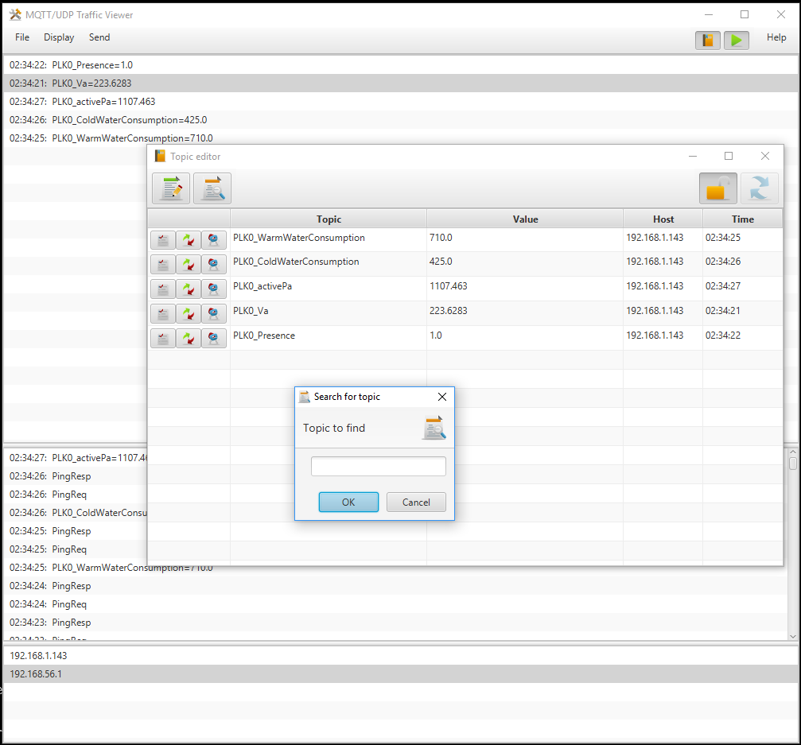

Welcome to MQTT/UDP
===================

.. toctree::
   :maxdepth: 2
   :caption: Contents:

Version |version|

Indices and tables
------------------

* :ref:`genindex`
* :ref:`modindex`
* :ref:`search`

*Network is a broker*

Introduction
------------

MQTT/UDP is a simplest possible protocol for IoT, smart home applications and robotics. As you can guess from its name, it is based on MQTT (which is quite simple too), but based on UDP.

Fast track for impatient readers: MQTT/UDP native implementations exist in Java, Python, C, Lua and PLC specific ST language. See corresponding references:

* :ref:`c-lang-api`
* :ref:`java-lang-api`
* :ref:`python-lang-api`
* :ref:`lua-lang-api`

Now some words on MQTT/UDP idea. It is quite simple. Broker is a `single point of failure <https://en.wikipedia.org/wiki/Single_point_of_failure>`_ and can be avoided. Actual
traffic of smart home installation is not too big and comes over a separated (by firewall) network. There are many listeners that need same data, such as:

* main UI subsystem (such as OpenHAB installation)
* special function controllers (light, climate units)
* per-room or per-function controllers (kitchen ventilation, bath room sensors, room CO2 sensors, etc)
* in-room displays (room and outdoor temperature)

All these points generate some information (local sensors, state) and need some other information. By the way, CAN bus/protocol is made for quite the same requirements,
but is not good for TCP/IP and Ethernet. Actually, to some extent, MQTT/UDP is CAN for Ethernet.

Possible topologies
-------------------

Here is a list of more or less obvious use cases for MQTT/UDP

Fault-tolerant sensors 
^^^^^^^^^^^^^^^^^^^^^^

Some 2-4 temperature sensors are placed in one room and send
updates every 10 seconds or so. Update topic is the same for all the
sensors, so that every reader gets mix of all the readings.

Reader should calculate average for last 4-8 readings.

Result: reader gets average temperature in room and failure of
one or two sensors is not a problem at all.

Trying to build corresponding configuration with traditional MQTT or,
for example, Modbus you will have to:

*   Setup broker
*   Setup transport (topic names) for all separate sensors
*   Setup some smart code which detects loss of updates from sensors
*   Still calculate average
*   Feed calculated average back if you want to share data with other system nodes

One sensor, many listeners
^^^^^^^^^^^^^^^^^^^^^^^^^^

IoT network is a lot of parties, operating together. It is usual that
many of them need one data source to make a decision. Just as an example,
my house control system consists of about 10 processing units of different
size. Many of them need to know if it is dark outside, to understand how
to control local lighting. Currently I have to distribute light sensor data
via two possible points of failure - controller it is connected to and
OpenHub software as a broker. I'm going to swithch to MQTT/UDP and feed
all the units directly.

Multiple smart switches
^^^^^^^^^^^^^^^^^^^^^^^

Some wall switches are controlling the same device. All of them send
and read one topic which translates on/off state for the device.

Of course, if one switch changes the state, all others read the state broadcast
and note it, so that next time each switch knows, which state it should
switch to.

It is possible, of course, that UDP packet from some switch will be lost.
So when you switch it, nothing happens. What do you do in such a situation?
Turn switch again, of course, until it works!

In this example I wanted to illustrate that even in this situation UDP
transport is not really that bad.

All the data is visible
^^^^^^^^^^^^^^^^^^^^^^^

That is a topology issue too. Broadcast/multicast nature of MQTT/UDP
lets you see what is going on on the "bus" exactly the same way as
all the parties see. There is a simple tool exist for that in this
repository, but you can use, for example well known WireShark as well.

Reliability
-----------

**NB! There's QoS support for MQTT/UDP is in development, which makes it as reliable as TCP version.**

As MQTT/UDP is based on UDP protocol, which does not guarantee packet delivery, one can suppose that MQTT/UDP is not reliable. Is it?

Not at all.

If we use it for repeated updates, such as sensor data transfer, UDP is actually more reliable, than TCP! Really. If our network drops each
second packet, TCP connection will be effectively dead, attempting to resend again and again outdated packets which are not needed anymore.
And MQTT/UDP will just loose half of readings, which is not really a problem for 99% of installations. So, TCP helps just if packet loss rate
is quite low.

Actualy, I made simple test [#f1]_ to ckeck UDP reliability. One host in my house's local net was generating MQTT/UDP traffic as fast as 
possible and other checked packets to be sequent, counting speed and error rate. Two IPTV units was started to show HD content and one 
of the computers was copying some few GBytes to file server. Result was quite surprising: MQTT/UDP error rate grew to... 0.4% with about 50K
packets/second, but TV sets stopped showing, being, obviusly, starved.

Anyway, I'm going to add completely reliable mode to MQTT/UDP in near future.

.. rubric:: Footnotes

.. [#f1] Corresponding tools are in repository and you can run such test yourself.

Packets and general logic
=========================

It is extremely simple to use MQTT/UDP. Basic use case is: one party sends ``PUBLISH`` packets,
other receives, selecting for itself ones with topics it needs. That is all. No connect,
no subscribe, no broker address to configure - we're broadcasting.

For most applications it is all that you need. But there are 3 other packet types that possibly can 
be used.

``SUBSCRIBE`` - MQTT/UDP uses this as a request to resend some topic value. It is not automated in any way by library code (but will be),
so you have to respond to such a packet manually, if you want. It is intended for remote configuration use to let configuration
program to request settings values from nodes. This is to be implemented later.

``PINGREQ`` - Ping request, ask all nodes to reply. This is for remote configuration also, it helps config program to detect all nodes on the network.
Library code automatically replies to ``PINGREQ`` with ``PINGRESP``.

``PINGRESP`` - reply to ping. You don't need to send it manually. It is done automatically.

I'm going to use ``PUBACK`` packet later to support reliable delivery

.. _c-lang-api:

C Language API Reference
========================

There is a native MQTT/UDP implementation in C. You can browse sources at https://github.com/dzavalishin/mqtt_udp/tree/master/lang/c repository.

Lets begin with a simplest examples.

Send data::

    int rc = mqtt_udp_send_publish( topic, value );

Listen for data::

    int main(int argc, char *argv[])
    {
        ...
    
        int rc = mqtt_udp_recv_loop( mqtt_udp_dump_any_pkt );
    
        ...
    }
    
    int mqtt_udp_dump_any_pkt( struct mqtt_udp_pkt *o )
    {
    
        printf( "pkt %x flags %x, id %d",
                o->ptype, o->pflags, o->pkt_id
              );
    
        if( o->topic_len > 0 )
            printf(" topic '%s'", o->topic );
    
        if( o->value_len > 0 )
            printf(" = '%s'", o->value );
    
        printf( "\n");
    }

Now lets get through the packet structure definition::

    struct mqtt_udp_pkt
    {
        int         from_ip;
    
        int         ptype;          // upper 4 bits, not shifted
        int         pflags;         // lower 4 bits
    
        size_t      total;          // length of the rest of pkt down from here
    
        int         pkt_id;
    
        size_t      topic_len;
        char *      topic;
    
        size_t      value_len;
        char *      value;
    };

Listen for packets
------------------

See `Example C code <https://github.com/dzavalishin/mqtt_udp/blob/master/lang/c/mqtt_udp_listen.c>`_.

For listening for data from the network you need just some of fields. First, you have to check
that packet is transferring item data::

    struct mqtt_udp_pkt p;
    
    if( p->ptype == PTYPE_PUBLISH )
    {
    // Got data message
    }

For the first implementation just ignore all other packets. Frankly, there's not much for you to ignore.

Now get topic and data from packet you got::

    strlcpy( my_value_buf, p->value, sizeof(my_data_buf) );
    strlcpy( my_topic_buf, p->topic, sizeof(my_topic_buf) );

And you're done, now ypou have topic and value received.

Includes
--------

There's just one::

    #include "mqtt_udp.h"

Functions
---------

Send PUBLISH packet::

    int mqtt_udp_send_publish( char *topic, char *data );

Send SUBSCRIBE packet::

    int mqtt_udp_send_subscribe( char *topic );

Send PINGREQ packet, ask others to respond::

    int mqtt_udp_send_ping_request( void );

Send PINGREST packet, tell that you're alive::

    int mqtt_udp_send_ping_responce( void );

Start loop for packet reception, providing callback to be called 
when packet arrives::

    typedef int (*process_pkt)( struct mqtt_udp_pkt *pkt );

    int mqtt_udp_recv_loop( process_pkt callback );

Dump packet structure. Handy to debug things::

    int mqtt_udp_dump_any_pkt( struct mqtt_udp_pkt *o );

UDP IO interface
----------------

Default implementation uses POSIX API to communicate with network, but for 
embedded use you can redefine corresponding functions.

Receive UDP packet. Must return sender's address in ``src_ip_addr``::

    int mqtt_udp_recv_pkt( int fd, char *buf, size_t buflen, int *src_ip_addr );

Broadcast UDP packet::

    int mqtt_udp_send_pkt( int fd, char *data, size_t len );

Send UDP packet (actually not used now, but can be later)::

    int mqtt_udp_send_pkt_addr( int fd, char *data, size_t len, int ip_addr );

Create UDP socket which can be used to send or broadcast::

    int mqtt_udp_socket(void);

Prepare socket for reception on MQTT_PORT::

    int mqtt_udp_bind( int fd )

Close UDP socket::

    int mqtt_udp_close_fd( int fd ) 

.. _java-lang-api:

Java Language API Reference
===========================

There is a native MQTT/UDP implementation in Java. You can browse sources at https://github.com/dzavalishin/mqtt_udp/tree/master/lang/java repository.

Again, here are simplest examples.

Send data::

    PublishPacket pkt = new PublishPacket(topic, value);
    pkt.send();

Listen for data::

    PacketSourceServer ss = new PacketSourceServer();
    ss.setSink( pkt -> { 
        System.out.println("Got packet: "+pkt);
    
        if (p instanceof PublishPacket) {
            PublishPacket pp = (PublishPacket) p;			
        }
    
    });

Listen for packets
------------------

See `Example Java code <https://github.com/dzavalishin/mqtt_udp/blob/master/lang/java/src/ru/dz/mqtt_udp/util/Sub.java>`_.

Here it is::

    package ru.dz.mqtt_udp.util;
    
    import java.io.IOException;
    import java.net.SocketException;
    
    import ru.dz.mqtt_udp.IPacket;
    import ru.dz.mqtt_udp.MqttProtocolException;
    import ru.dz.mqtt_udp.SubServer;
    
    public class Sub extends SubServer 
    {
    
        public static void main(String[] args) throws SocketException, IOException, MqttProtocolException 
        {
            Sub srv = new Sub();
            srv.start();
        }

        @Override
        protected void processPacket(IPacket p) {
            System.out.println(p);
                
            if (p instanceof PublishPacket) {
                PublishPacket pp = (PublishPacket) p;

                // now use pp.getTopic() and pp.getValueString() or pp.getValueRaw()
            }
        }
    }

Now what we are doung here. Our class ``Sub`` is based on ``SubServer``, which is doing all the reception job, and calls ``processPacket``
when it got some data for you. There are many possible types of packets, but for now we need just one, which is
``PublishPacket``. Hence we check for type, and convert::

    if (p instanceof PublishPacket) {
        PublishPacket pp = (PublishPacket) p;

Now we can do what we wish with data we got using ``pp.getTopic()`` and ``pp.getValueString()``.

Listen code we've seen in a first example is slightly different::

    PacketSourceServer ss = new PacketSourceServer();
    ss.setSink( pkt -> { 
        System.out.println("Got packet: "+pkt);
    
        if (p instanceof PublishPacket) {
            PublishPacket pp = (PublishPacket) p;			
        }
    
    });

Used here ``PacketSourceServer``, first of all, starts automatically, and uses ``Sink`` you pass to ``setSink``
to pass packets received to you. The rest of the story is the same.

.. _python-lang-api:

Python Language API Reference
=============================

As you already guessed, python implementation is native too. You can browse sources at https://github.com/dzavalishin/mqtt_udp/tree/master/lang/python3 repository.
There is also lang/python directory, which is for older 2.x python environment, but it is outdated. Sorry, can't afford to support it. You can backport some
python3 code, it should be quite easy.

Let's begin with examples, as usual.

Send data::

    mqttudp.engine.send_publish_packet( "test_topic", "Hello, world!" )

Listen for data::

    def recv_packet(ptype,topic,value,pflags,addr):
        if ptype != "publish":
            print( ptype + ", " + topic + "\t\t" + str(addr) )
            return
        print( topic+"="+value+ "\t\t" + str(addr) )
       
    mqttudp.engine.listen(recv_packet)

All functions
-------------

* ``send_ping()`` - send PINGREQ packet.
* ``send_ping_responce()`` - send PINGRESP packet. It is sent automatically, you don't have to.
* ``listen(callback)`` - listen for incoming packets.
* ``send_publish_packet( topic, payload)`` - this what is mostly used.
* ``send_subscribe(topic)`` - ask other party to send corresponding item again. This is optional.

.. _lua-lang-api:

Lua Language API Reference
==========================

**NB! Lua API is not final, there will be some methods rename.**

You can browse sources at https://github.com/dzavalishin/mqtt_udp/tree/master/lang/lua repository.

Basic examples in Lua.

Send data::

    local mq = require "mqtt_udp_lib"
    mq.publish( topic, val );

Listen for data::

    local mq = require "mqtt_udp_lib"
    
    local listener = function( ptype, topic, value, ip, port )
        print("'"..topic.."' = '"..val.."'".."	from: ", ip, port)
    end
    
    mq.listen( listener )

Connectors
==========

Classic MQTT
------------

It is obvious that MQTT/UDP can be used together with traditional MQTT, so there's a simple gateway to 
pass traffic back and forth. It is written in Python and copies everything from one side to another and
back. There's interlock logic introduced that prevents loops by not passing same topic message in reverse 
direction for some 5 seconds.

OpenHAB
-------

At the moment there is just one way gateway, from MQTT/UDP to OpenHAB. Bidirectional one is in development.

Scripts
=======

There are Python scripts I made to help myself testing MQTT/UDP library. Some of them are written in C and Lua too
but most exist just in Python version.

* **random_to_udp.py** - send random numbers with 2 sec interval, to test reception.
* **dump.py** - just show all traffic.
* **ping.py** - send ping and show responces. Note that running ping.py will resond to itself too.
* **subscribe.py** - send subscribe request.
* **seq_storm_send.py** - send sequential data with no speed limit (use -s to set limit, though).
* **seq_storm_check.py** - check traffic sent by *seq_storm_send.py* and calculate speed and error rate.

Traffic viewer
==============

A GUI tool to view what's going on and send data too.

Read more at project Wiki: https://github.com/dzavalishin/mqtt_udp/wiki/MQTT-UDP-Viewer-Help

Links
=====

GitHUb: https://github.com/dzavalishin/mqtt_udp

Error reports and feature requests: https://github.com/dzavalishin/mqtt_udp/issues

If you use MQTT/UDP, please let me know by adding issue at GitHub. :)

